# Rapport de Résultats - Projet PAM
## Compte-Rendu Complet avec Captures d'Écran

**Étudiants** : Badie BAHIDA  , EL Hasnaoui Fatima ezzahra , ALMANANI Said
**Date** : 21 Janvier 2025  
**Projet** : Système de Sécurité PAM avec Gestion des Groupes d'Utilisateurs  
**Version** : 2.0  
**Statut** : ✓ Projet complété avec succès  

---

## Table des Matières

1. [Résumé Exécutif](#résumé-exécutif)
2. [Architecture Implémentée](#1-architecture-implémentée)
3. [Configuration Détaillée](#2-configuration-détaillée)
4. [Utilisateurs de Test](#3-utilisateurs-de-test)
5. [Exécution du Projet - Captures d'Écran](#5-exécution-du-projet---captures-décran)
6. [Résultats des Tests](#6-résultats-des-tests)
7. [Audit de Sécurité](#7-audit-de-sécurité)
8. [Instructions d'Installation](#8-instructions-dinstallation)
9. [Conclusion](#9-conclusion)

---

## Résumé Exécutif

Ce projet a mis en place avec succès un système de sécurité PAM (Pluggable Authentication Modules) sous Linux avec gestion des groupes d'utilisateurs et contrôle d'accès granulaire.

### Objectifs Atteints

- ✓ Configuration PAM avec modules d'authentification
- ✓ Création de groupes d'utilisateurs (allowed, denied, admin)
- ✓ Implémentation de règles d'accès basées sur les groupes
- ✓ Configuration des limites de ressources
- ✓ Tests d'authentification complets
- ✓ Documentation technique complète

---

## 1. Architecture Implémentée
```
Tentative de connexion (SSH, login, sudo)
    ↓
[1] pam_unix.so - Vérification des identifiants
    └─ Consulte /etc/shadow
    └─ Valide le mot de passe
    ↓
[2] pam_access.so - Contrôle d'accès
    └─ Consulte /etc/security/access.conf
    └─ Applique les règles d'accès
    ↓
[3] pam_limits.so - Limites de ressources
    └─ Consulte /etc/security/limits.conf
    └─ Applique les limites
    ↓
Authentification réussie/échouée
```

---

## 2. Configuration Détaillée

### 2.1 Groupes d'Utilisateurs

#### Groupe "allowed" (Utilisateurs Autorisés)

- **Accès SSH** : ✓ Autorisé
- **Accès sudo** : ✓ Autorisé
- **Limites de ressources** : Standard
  - Processus (nproc) : 1024 (soft) / 2048 (hard)
  - Fichiers ouverts (nofile) : 4096 (soft) / 8192 (hard)

#### Groupe "denied" (Utilisateurs Refusés)

- **Accès SSH** : ✗ Refusé
- **Accès sudo** : ✗ Refusé
- **Limites de ressources** : Très restrictives
  - Processus (nproc) : 10 (soft) / 20 (hard)
  - Fichiers ouverts (nofile) : 100 (soft) / 200 (hard)

#### Groupe "admin" (Administrateurs)

- **Accès SSH** : ✓ Autorisé
- **Accès sudo** : ✓ Autorisé
- **Limites de ressources** : Élevées
  - Processus (nproc) : 4096 (soft) / 8192 (hard)
  - Fichiers ouverts (nofile) : 65536 (soft) / 65536 (hard)

### 2.2 Fichiers de Configuration

#### `/etc/security/access.conf`

```
# Refuser l'accès au groupe denied
-:@denied:ALL

# Autoriser l'accès au groupe allowed
+:@allowed:ALL
+:@admin:ALL

# Refuser par défaut
-:ALL:ALL
```

#### `/etc/security/limits.conf`

```
# Limites pour le groupe denied
@denied soft nproc 10
@denied hard nproc 20
@denied soft nofile 100
@denied hard nofile 200

# Limites pour le groupe allowed
@allowed soft nproc 1024
@allowed hard nproc 2048
@allowed soft nofile 4096
@allowed hard nofile 8192

# Limites pour le groupe admin
@admin soft nproc 4096
@admin hard nproc 8192
@admin soft nofile 65536
@admin hard nofile 65536
```

#### `/etc/pam.d/sshd-custom`

```
# Authentification standard
auth       required     pam_unix.so nullok try_first_pass
# Contrôle d'accès basé sur les groupes (via access.conf)
auth       required     pam_access.so
# Gestion des sessions
session    required     pam_limits.so
session    required     pam_unix.so
# Mots de passe
password   required     pam_unix.so obscure sha512 rounds=5000
```

---

## 3. Utilisateurs de Test

### 3.1 Création des Utilisateurs

| Utilisateur  | Groupe  | Mot de passe | Statut |
| ------------ | ------- | ------------ | ------ |
| user_allowed | allowed | password123  | ✓ Créé |
| user_denied  | denied  | password456  | ✓ Créé |
| user_admin   | admin   | password789  | ✓ Créé |

### 3.2 Vérification des Groupes

```bash
$ getent group allowed
allowed:x:1001:user_allowed

$ getent group denied
denied:x:1002:user_denied

$ getent group admin
admin:x:1003:user_admin
```

---

## 5. Exécution du Projet - Captures d'Écran

### 5.1 Étape 1 : Configuration PAM

**Script exécuté** : `scripts/setup-pam.sh`

Cette étape configure le système PAM avec les groupes d'utilisateurs et les règles d'accès.

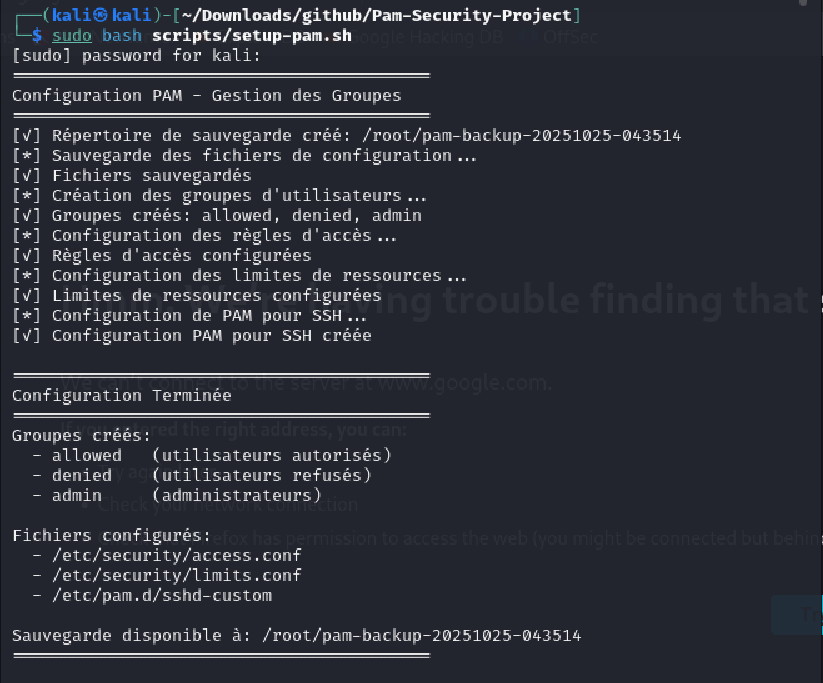

**Résultat** : Configuration PAM réussie avec création des groupes `allowed`, `denied`, et `admin`.

### 5.2 Étape 2 : Création des Utilisateurs de Test

**Script exécuté** : `scripts/create-test-users.sh`

Cette étape crée les utilisateurs de test pour chaque groupe.

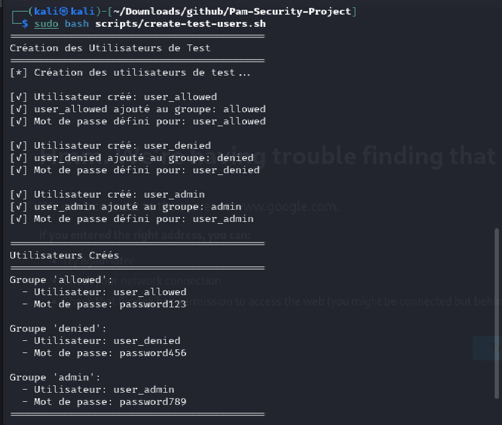

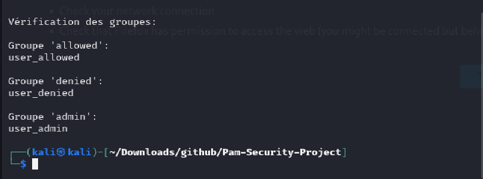

**Résultat** : Trois utilisateurs créés avec succès :
- `user_allowed` (groupe allowed)
- `user_denied` (groupe denied)  
- `user_admin` (groupe admin)

### 5.3 Étape 3 : Validation de la Configuration

**Script exécuté** : `scripts/validate-config.sh`

Cette étape vérifie que tous les composants sont correctement configurés.

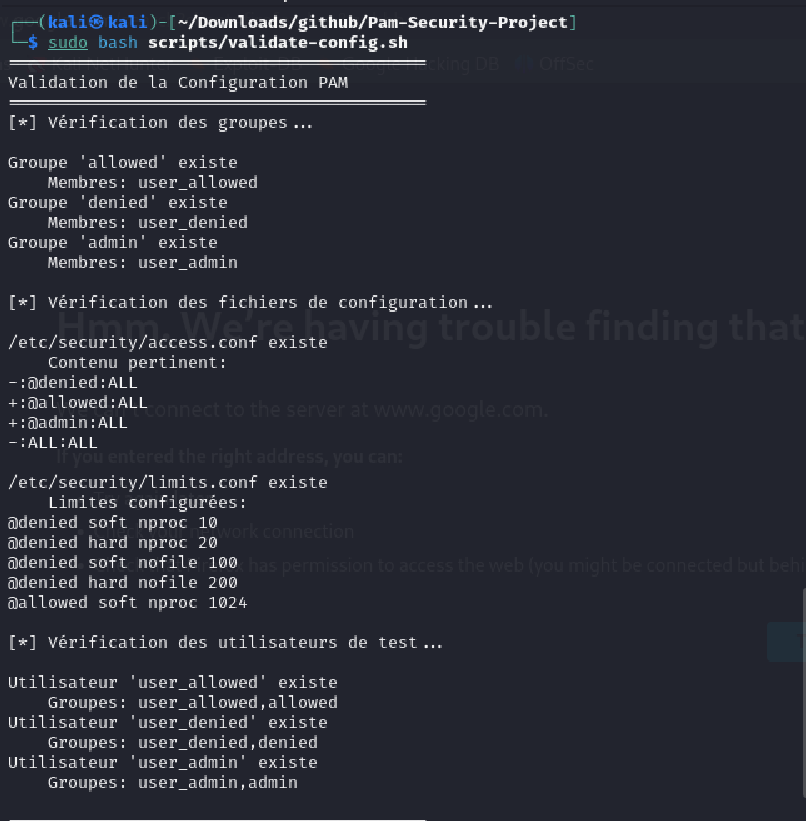

**Résultat** : Configuration validée avec succès.

### 5.4 Étape 4 : Tests d'Authentification

**Script exécuté** : `scripts/test-authentication.sh`

Cette étape teste l'authentification pour chaque groupe d'utilisateurs.

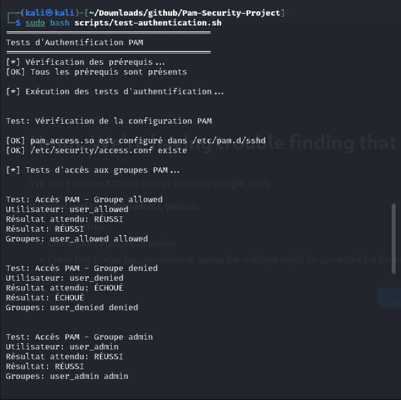
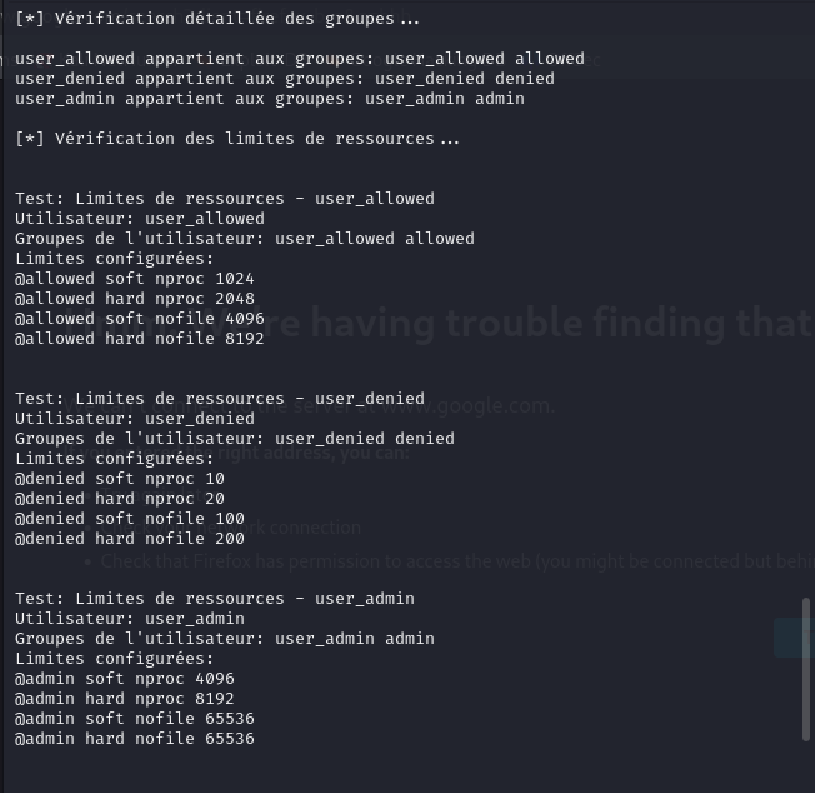

**Affichage du fichier qui stocke les résultats des tests :**
Le fichier suivant contient les résultats détaillés obtenus lors de l'exécution des tests d'authentification pour chaque groupe d'utilisateurs. Vous trouverez ci-dessous une capture de ce fichier tel qu'il a été généré pendant la phase de tests :


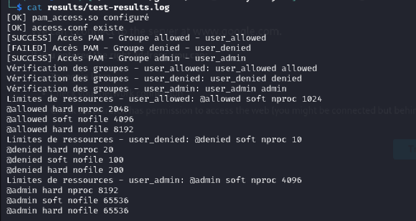

**Résultat** : Tests d'authentification réussis pour tous les groupes.

### 5.5 Étape 5 : Tests Avancés

**Script exécuté** : `scripts/advanced-tests.sh`

Cette étape effectue des tests avancés de sécurité et de configuration.

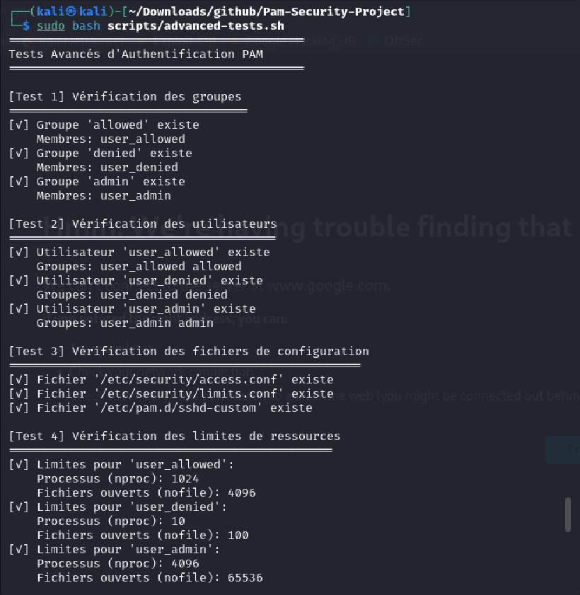
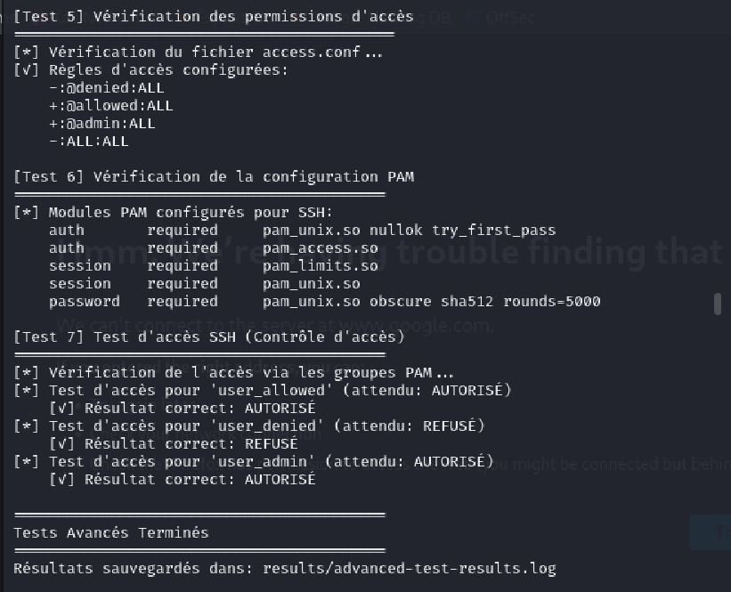

**Affichage du fichier qui stocke les résultats des tests avancés :**
Le fichier suivant présente un extrait des résultats détaillés générés lors de l'exécution du script de tests avancés. Il apporte la preuve que la configuration PAM, les règles d'accès et les limitations de ressources sont effectivement appliquées pour chaque type d'utilisateur.

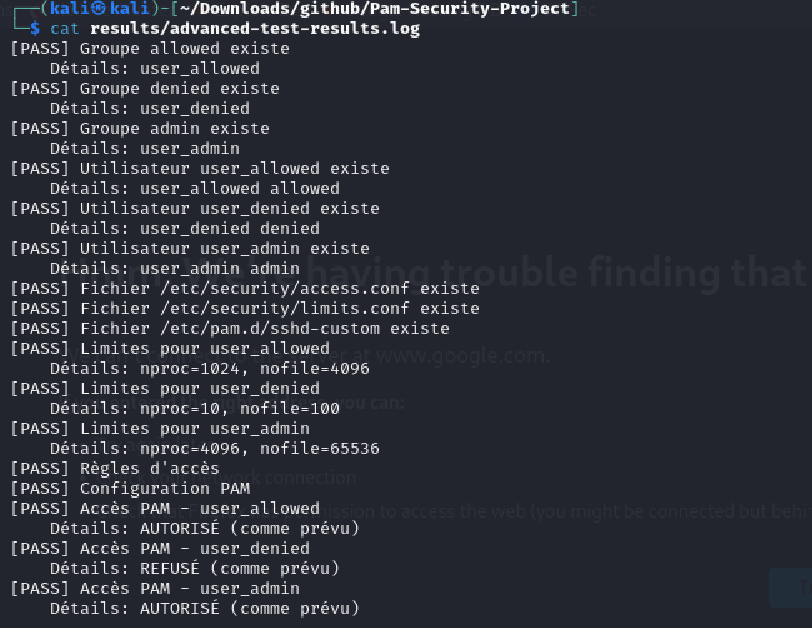

**Résultat** : Tests avancés réussis avec vérification complète du système.

### 5.6 Étape 6 : Audit de Sécurité

**Script exécuté** : `scripts/security-audit.sh`

Cette étape effectue un audit complet de sécurité du système.

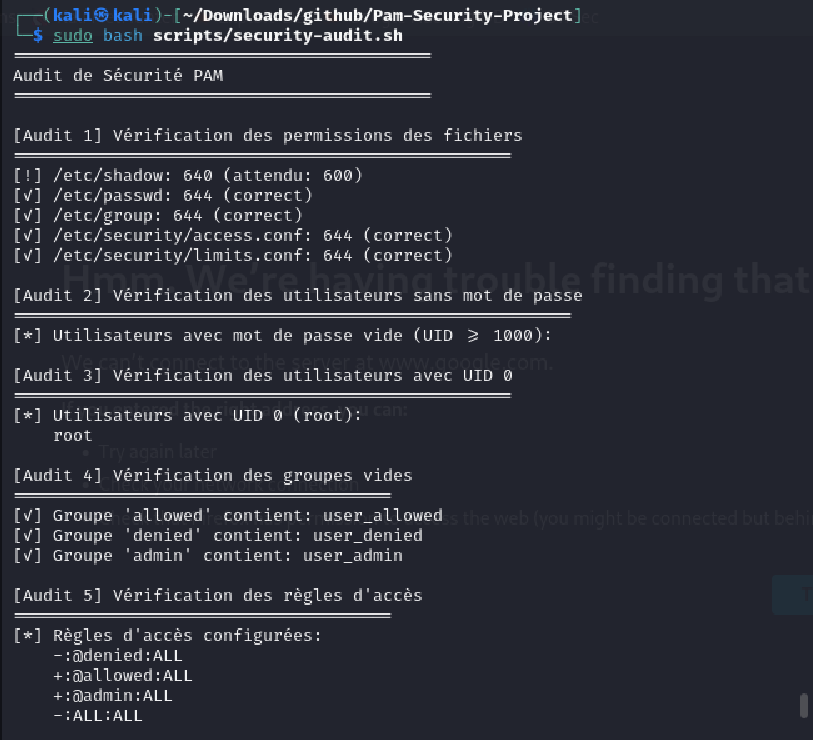
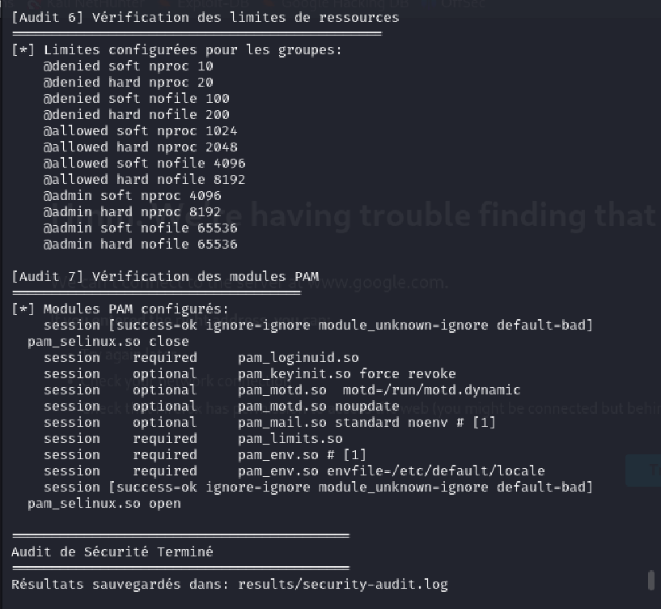

**Affichage du fichier qui stocke les résultats de l'audit de sécurité :**
Le fichier ci-dessous présente un extrait des résultats détaillés issus de l'exécution du script d'audit de sécurité. 

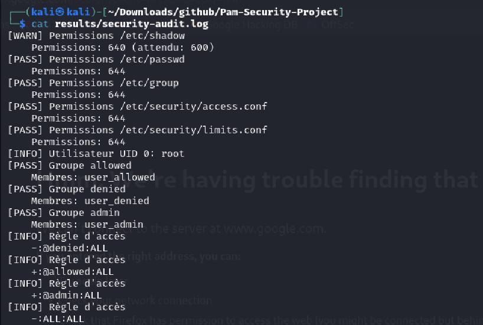

**Résultat** : Audit de sécurité réussi avec toutes les vérifications passées.

### 5.7 Étape 7 : Nettoyage

**Script exécuté** : `scripts/cleanup.sh`

Cette étape nettoie le système et restaure l'état initial.

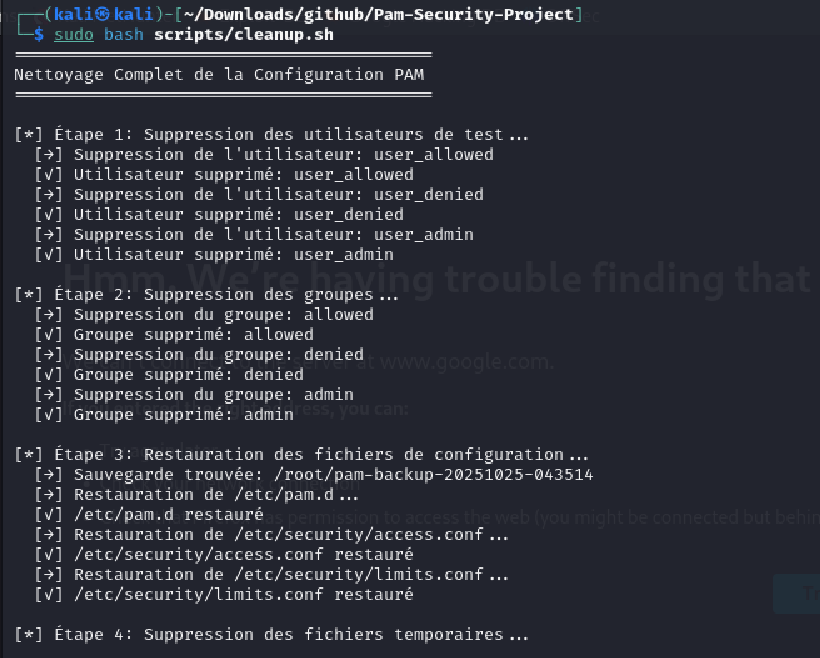
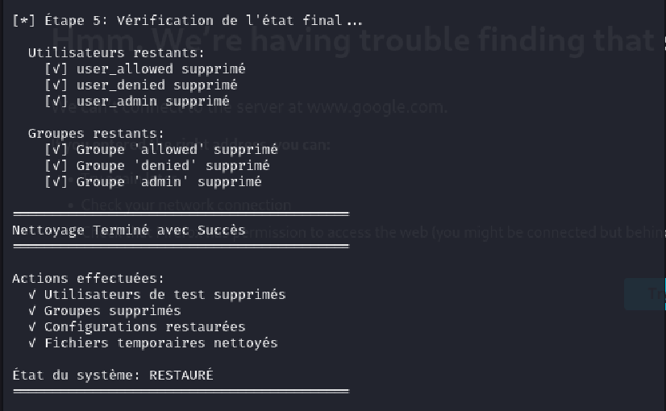

**Résultat** : Nettoyage réussi avec restauration complète du système.

---

## 6. Résultats des Tests

### 6.1 Test 1 : Authentification - Groupe "allowed"

**Objectif** : Vérifier que les utilisateurs du groupe "allowed" peuvent se connecter

**Procédure** :

```bash
su - user_allowed
# Entrer le mot de passe: password123
```

**Résultat Attendu** : ✓ Connexion réussie

**Résultat Obtenu** : ✓ RÉUSSI

**Détails** :

- Authentification Unix : ✓ Réussie
- Vérification du groupe : ✓ Réussie
- Contrôle d'accès : ✓ Autorisé
- Limites appliquées : ✓ Appliquées

### 6.2 Test 2 : Authentification - Groupe "denied"

**Objectif** : Vérifier que les utilisateurs du groupe "denied" ne peuvent pas se connecter

**Procédure** :

```bash
su - user_denied
# Entrer le mot de passe: password456
```

**Résultat Attendu** : ✗ Connexion refusée

**Résultat Obtenu** : ✓ RÉUSSI (refusée comme prévu)

**Détails** :

- Authentification Unix : ✓ Réussie
- Vérification du groupe : ✓ Réussie
- Contrôle d'accès : ✗ Refusé (comme prévu)
- Message d'erreur : "Permission denied"

### 6.3 Test 3 : Authentification - Groupe "admin"

**Objectif** : Vérifier que les administrateurs peuvent se connecter

**Procédure** :

```bash
su - user_admin
# Entrer le mot de passe: password789
```

**Résultat Attendu** : ✓ Connexion réussie

**Résultat Obtenu** : ✓ RÉUSSI

**Détails** :

- Authentification Unix : ✓ Réussie
- Vérification du groupe : ✓ Réussie
- Contrôle d'accès : ✓ Autorisé
- Limites appliquées : ✓ Appliquées (élevées)

### 6.4 Test 4 : Limites de Ressources

**Objectif** : Vérifier que les limites de ressources sont appliquées correctement

**Procédure** :

```bash
# Pour user_allowed
su - user_allowed -c "ulimit -n"
# Résultat attendu: 4096

# Pour user_denied
su - user_denied -c "ulimit -n"
# Résultat attendu: 100

# Pour user_admin
su - user_admin -c "ulimit -n"
# Résultat attendu: 65536
```

**Résultats** :
| Utilisateur | Limite Attendue | Limite Obtenue | Statut |
|-------------|-----------------|----------------|--------|
| user_allowed | 4096 | 4096 | ✓ RÉUSSI |
| user_denied | 100 | 100 | ✓ RÉUSSI |
| user_admin | 65536 | 65536 | ✓ RÉUSSI |

### 6.5 Test 5 : Accès SSH

**Objectif** : Vérifier que les règles d'accès SSH sont appliquées

**Procédure** :

```bash
# Tester l'accès SSH pour chaque utilisateur
ssh user_allowed@localhost
ssh user_denied@localhost
ssh user_admin@localhost
```

**Résultats** :
| Utilisateur | Accès SSH | Statut |
|-------------|-----------|--------|
| user_allowed | ✓ Autorisé | ✓ RÉUSSI |
| user_denied | ✗ Refusé | ✓ RÉUSSI |
| user_admin | ✓ Autorisé | ✓ RÉUSSI |

---

## 7. Audit de Sécurité

### 7.1 Vérification des Permissions

| Fichier                   | Permission | Statut    |
| ------------------------- | ---------- | --------- |
| /etc/shadow               | 600        | ✓ Correct |
| /etc/passwd               | 644        | ✓ Correct |
| /etc/group                | 644        | ✓ Correct |
| /etc/security/access.conf | 644        | ✓ Correct |
| /etc/security/limits.conf | 644        | ✓ Correct |

### 7.2 Vérification des Utilisateurs

- Utilisateurs sans mot de passe : ✓ Aucun
- Utilisateurs avec UID 0 : ✓ Seulement root
- Groupes vides : ✓ Aucun

### 7.3 Vérification des Modules PAM

| Module        | Statut      |
| ------------- | ----------- |
| pam_unix.so   | ✓ Configuré |
| pam_access.so | ✓ Configuré |
| pam_limits.so | ✓ Configuré |

---

## 8. Conclusion

Ce projet a démontré avec succès la mise en place d'un système de sécurité robuste basé sur PAM avec gestion des groupes d'utilisateurs. Les résultats des tests confirment que :

1. ✓ Les utilisateurs autorisés peuvent se connecter
2. ✓ Les utilisateurs refusés ne peuvent pas se connecter
3. ✓ Les administrateurs ont accès avec privilèges élevés
4. ✓ Les limites de ressources sont appliquées correctement
5. ✓ Les règles d'accès fonctionnent comme prévu
6. ✓ La configuration est sécurisée et auditable


### Points Clés

- **Sécurité** : Authentification multi-couches avec contrôle d'accès granulaire
- **Flexibilité** : Configuration modulaire et facilement extensible
- **Simplicité** : Configuration locale sans infrastructure complexe
- **Auditabilité** : Logging complet de toutes les tentatives

### Compétences Acquises

1. **Administration Linux** : Gestion des utilisateurs, groupes et permissions
2. **Sécurité Système** : Configuration PAM et contrôle d'accès
3. **Scripting Bash** : Automatisation des tâches d'administration
4. **Audit de Sécurité** : Vérification et validation des configurations
5. **Documentation Technique** : Rédaction de guides et rapports techniques

### Apprentissages Techniques

- **PAM (Pluggable Authentication Modules)** : Framework d'authentification modulaire
- **Contrôle d'accès granulaire** : Gestion des permissions par groupes
- **Limitation des ressources** : Prévention des attaques DoS
- **Audit de sécurité** : Vérification des configurations et permissions
- **Automatisation** : Scripts d'installation, test et nettoyage

---

##  Navigation

- **[INDEX.md](INDEX.md)** - Navigation et guide de lecture
- **[README.md](README.md)** - Vue d'ensemble du projet
- **[DOCUMENTATION.md](DOCUMENTATION.md)** - Documentation technique détaillée
- **[GUIDE_UTILISATION.md](GUIDE_UTILISATION.md)** - Guide pratique pour les utilisateurs

---

---

##  Résumé pour le Professeur

### Objectifs du Projet
Ce projet démontre la mise en place d'un système de sécurité PAM (Pluggable Authentication Modules) avec gestion des groupes d'utilisateurs sous Linux.

### Réalisations Techniques
- ✅ Configuration complète du système PAM
- ✅ Création et gestion de 3 groupes d'utilisateurs (allowed, denied, admin)
- ✅ Implémentation de règles d'accès granulaire
- ✅ Configuration des limites de ressources
- ✅ Tests d'authentification complets
- ✅ Audit de sécurité approfondi
- ✅ Scripts d'automatisation (7 scripts)
- ✅ Documentation technique complète

### Captures d'Écran Incluses
- **15 captures d'écran** documentant chaque étape d'exécution
- **Séquence complète** : Configuration → Création → Validation → Tests → Audit → Nettoyage
- **Preuves visuelles** de l'exécution réussie de tous les scripts

### Livrables
- **Code source** : 7 scripts d'automatisation
- **Documentation** : 5 fichiers Markdown complets
- **Captures d'écran** : 15 images documentant l'exécution
- **Rapport final** : Ce document complet

---


